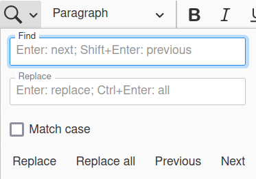
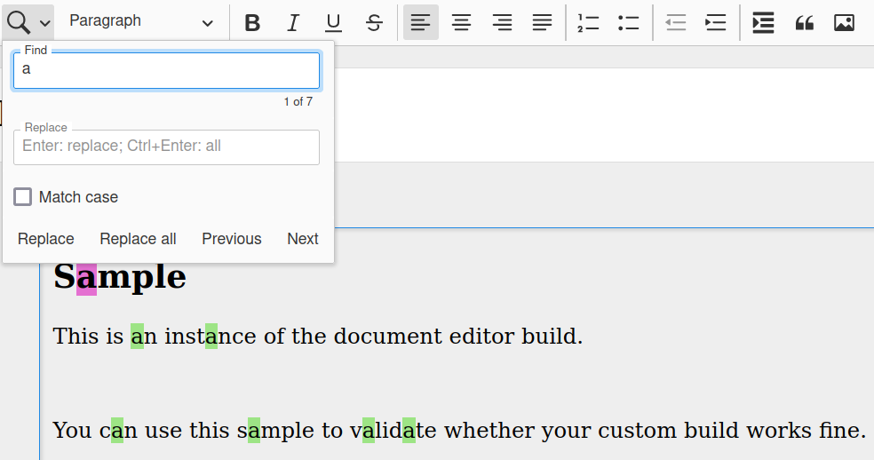

CKEditor 5 Find and Replace feature
============================

This package implements Find and Replace Text in CKEditor 5.

I looked everywhere and did not find an solution for CKEditor 5. So I did it one.

It supports:
- forward and backwards search (with visual and text indications of progress)
- replace one or all occurrences
- accessible (keyboard operation)

We need translators! If you want to translate to your language, open a PR!
PT and EN supported right now.

## Installation
```shell script
$ npm install ckeditor5-find-replace
```

then you can use in your build like this

```javascript
import FindReplace from 'ckeditor5-find-replace/src/findReplace';

// it can be any CKEditor flavour
DecoupledEditor.builtinPlugins = [
//...
	FindReplace,
]
//...
	toolbar: {
		items: [
			'FindReplace'
        ]
    }
```

Images of plugin:






## License

MIT
