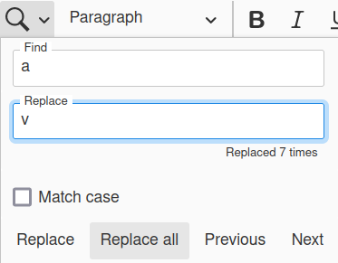

CKEditor 5 Find and Replace feature
============================

When I started this project, there was no such plugin for search and replace items. Now, I recommend you to use the official plugin: https://ckeditor.com/docs/ckeditor5/latest/features/find-and-replace.html

I would like to thank everyone that helped me in this project!

Documentation
============================

This plugin implements Find and Replace Text in CKEditor 5.

Features:
- forward and backwards search (with visual and text indications of progress)
- replace one (also forward and backwards) or all occurrences 
- accessible (keyboard operation)
- use out of the editor (by execute findReplace command)
- Match case: you decide if upper or lower case matters
- selected text gets copied over to the find field

We need translators! If you want to translate to your language, open a PR! Supported so far:
- pt-BR
- en-US
- zh-CN (Thanks @YueHui)

## Installation
```shell script
$ npm install ckeditor5-find-replace
```

To use it, configure your build like this

```javascript
import FindReplace from 'ckeditor5-find-replace/src/findReplace';

// it can be any CKEditor editor. Decoupled is just an example
DecoupledEditor.builtinPlugins = [
//...
	FindReplace,
]
//...
	toolbar: {
		items: [
			'FindReplace'
        ]
    }
```

```javascript
// you can use this feature programatically also:
editor.execute('findReplace', {
    // text to find
    findText: '',
    // find prev or next , -1:prev,0:stay,1:next
    increment: 1 ,
    // text to replace
    replaceText: '',
    // is replaceAll
    replaceAll: false,
    // lower or upper case letters matters? 
    matchCase: false
})
```


Images of plugin:





## License

MIT
